
## MDDN 242 2024 Assignment 2

### Table of contents
- [SharpGlow:](#sharpglow)
  - [Author](#author)
  - [The parameters per letter:](#the-parameters-per-letter)
  - [Design Process](#design-process)
    - [Step 1](#step-1)
    - [Step 2](#step-2)
    - [Step 3](#step-3)
    - [Step 4](#step-4)
    - [Step 5](#step-5)
    - [Reflection](#reflection)

# SharpGlow: 

My font consists of two parts: __the main body__ and __the second body__. __The main body__ Consists of a thick black line and a green rectangle. __The second body__ is composed of long green lines and thin black combined lines. The color and line weight of my font are fixed. Different __second body__ parts are controlled by different __main body__ parameters respectively. Through these values, you can control the position of the line and rectangle, the size of the rectangle, and the rotation angle of the thin line.

## Author
Hi, I'm Lan.

## The parameters per letter:
  * `wsize` : the width of the a green rectangle of the main body
  
  * `hsize` : the length of the a green rectangle of the main body
  * `offsetx1` : x1 offset of a thick black line of the main body and the long section of one long green line of the second body
  * `offsety1` : y1 offset of a thick black line of the main body and the long section of one long green line of the second body
  * `offsetx2` : x2 offset of a thick black line of the main body and the long section of one long green line of the second body
  * `offsety2` : y2 offset of a thick black line of the main body and the long section of one long green line of the second body
  * `offsetx3` : x3 offset of a thick black line of the main body and the long section of one long green line of the second body
  * `offsety3` : y3 offset of a thick black line of the main body and the long section of one long green line of the second body
  * `offsetx4` : x4 offset of a thick black line of the main body and the long section of one long green line of the second body
  * `offsety4` : y4 offset of a thick black line of the main body and the long section of one long green line of the second body
  * `offsetRECTX` : y offset of the rectangle of the main body and the thin black combined lines of the second body
  * `offsetRECTY` : y offset of the rectangle of thin black combined lines of the second body

## Design Process

###  Step 1
My initial design was a few squares in different arrangements, with different rounded corners, which could become rounded at their roundest. I did a coding exercise based on my initial inspiration. I realized that I couldn't round the corners of the square to make it a circle, so I decided to change the design.
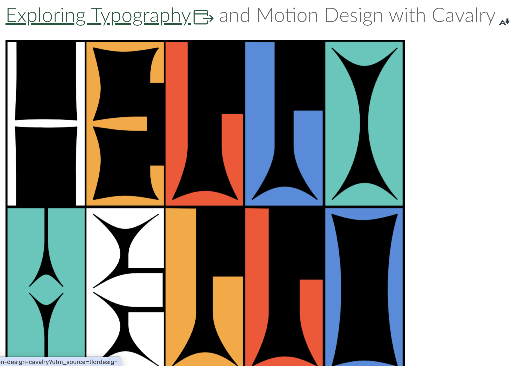
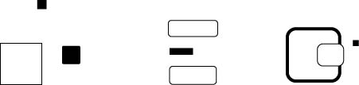
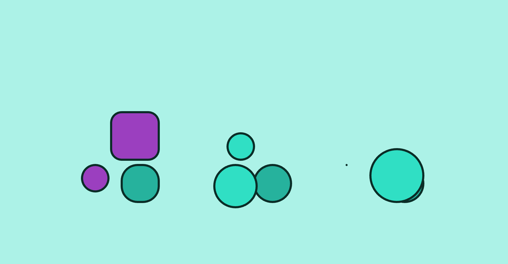

###  Step 2
I made changes to my design, I changed the design elements squares to lines and rectangles. and completed the sketch of the letters.
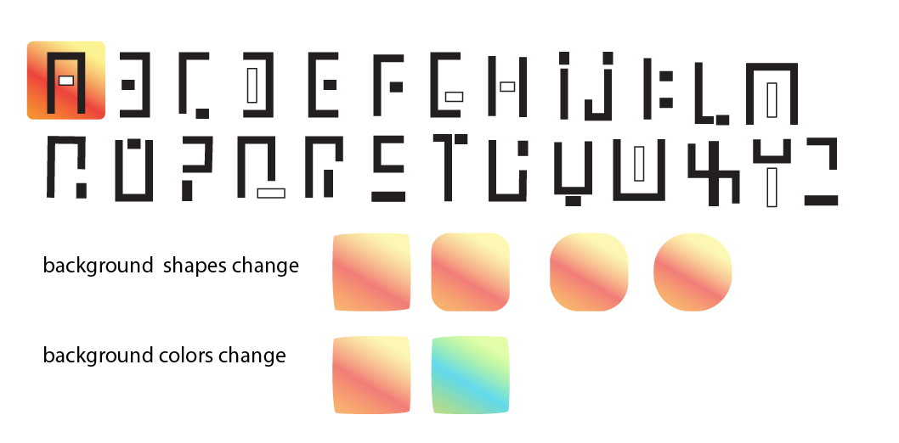

###  Step 3
According to the design sketch, I completed the coding of the letters. But the font looked too simple, so I made further sketches based on the current letters. At the same time I drew the design sketch of the numbers.
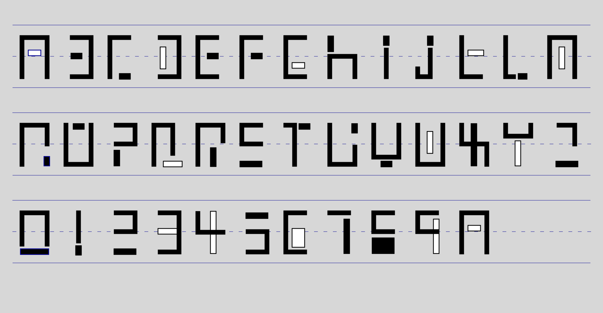
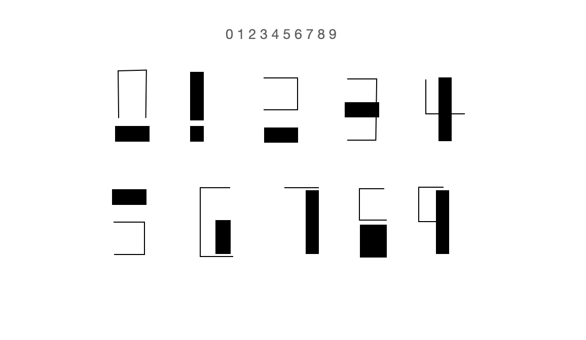

###  Step 4
According to the design sketch, I completed the coding of the letters. But the font looked too simple, so I made further sketches based on the current letters.
I tried to improve my letter coding based on the updated sketch design, and I discovered serious problems. I have too many parameters, well over 20. I feel very upset. At first I thought about using rectangular blocks to replace the lines of the main body, but considering the time cost, I gave up on it. Ultimately, I decided to use the "draw target" feature taught in class. 
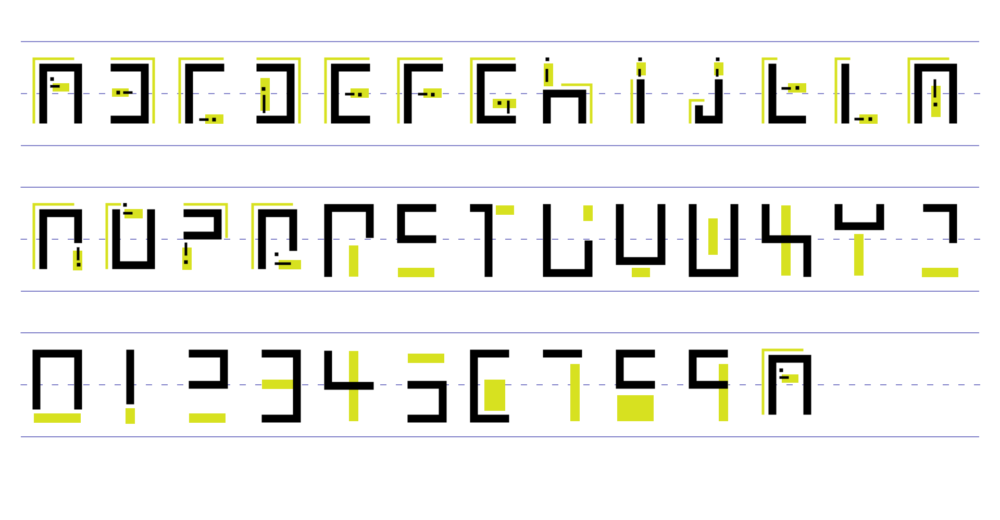
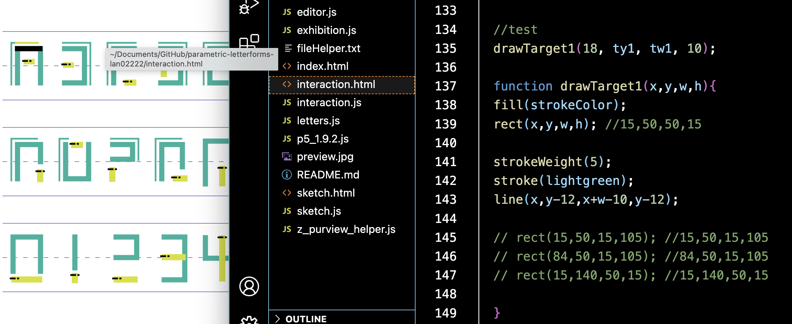

Finally, the draw target feature allowed me to significantly reduce the parameters, although their visuals were slightly different than my sketched design.
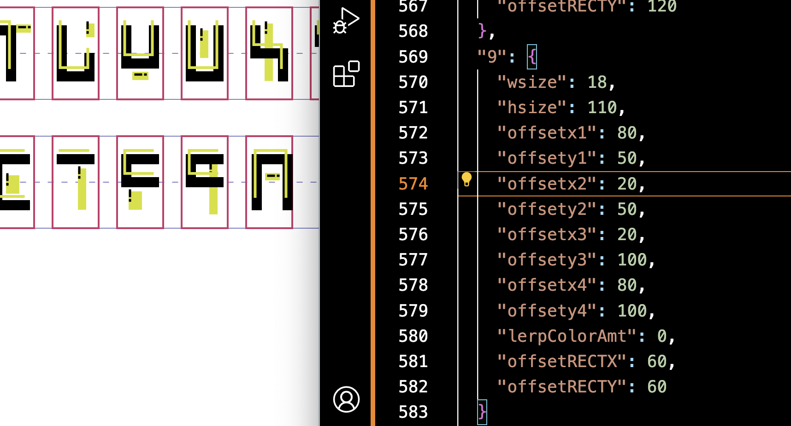
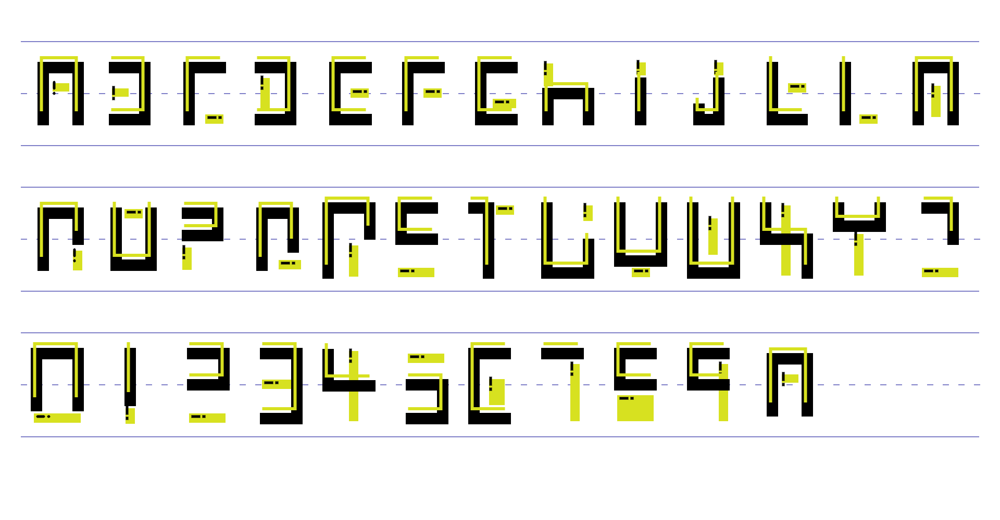

Also my "draw target" function merges the green rectangle and 2 black lines. And set the conditions so that they rotate 90 degrees when the width of the rectangle changes.

###  Step 5
When animating, my idea was to pan to the left and shorten the length of the letters. Because I don't have many parameters to control the letters changing too much. After continuous exploration, the final animation effect is that the letters move to the left, while shortening y, and the shape and position of the rectangle change. At 50% variation, the letters look like several small squares.
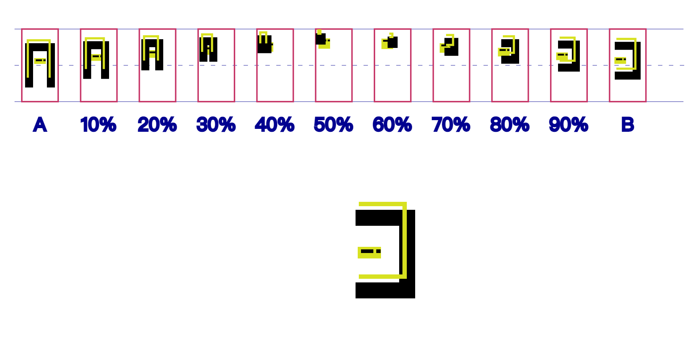

I improved the appearance of some letters.
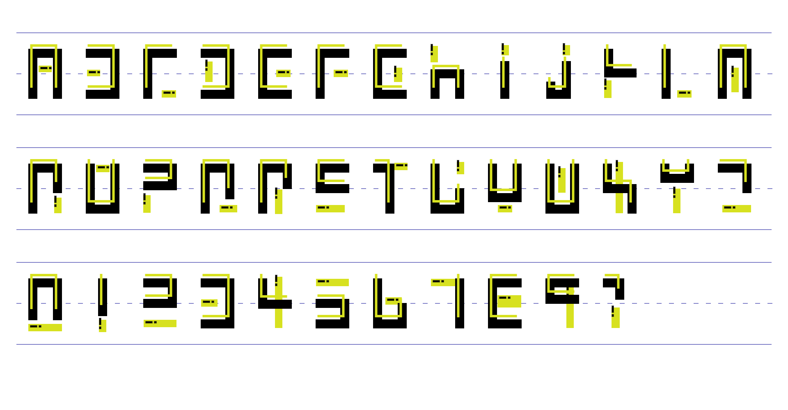

###  Reflection
I should be the one who wants to change my parameters when doing animation effects. In the beginning I was too focused on the shapes of the letters, this project I started with building my letters to consider my parameters. If I were to do this project again, I would be more interested in building my letters by thinking about the parameters starting from the visuals of the animation. I think the visuals would be more interesting and varied that way. Anyway it was a fun experience working on fonts.